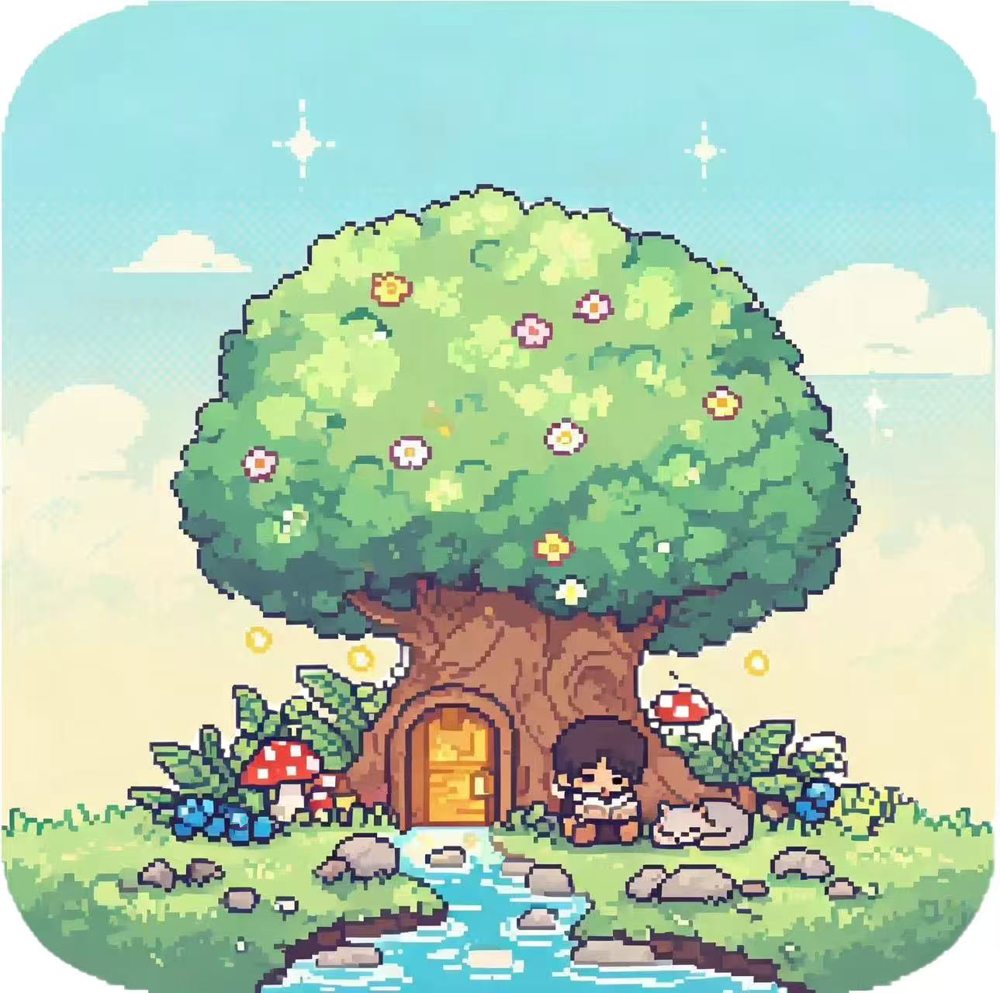

<div align="center">

# 予己

### 好好爱自己，慢慢成为自己。

**一款像素轻游戏风格的治愈向内成长 App** —— 把"看见自己、认识自己、成长自己、沉淀自己"做成四个可触摸的像素场景。


> 🏆 96 小时shenicest黑客松参赛项目 · 两人协作 · 从概念到可演示 Demo 全流程落地
>
> `本项目仅供学习与个人使用，未经授权请勿用于商业用途`


---

<p align="center">  
    
</p>

</div>

---

## 一、项目速览

> **予己不是帮助用户成为更完美的人。**  
> **而是帮助用户：看见现在的自己、理解真实的自己、接纳不完整的自己、找到适合自己的成长方式，成为更懂自己的自己。**

| 一句话定位    | 一款像素轻游戏风格的治愈向内成长 App                           |
| -------- | ---------------------------------------------- |
| **核心载体** | 屏幕里另一个像素小人「小我」，不催促、不评判、不惩罚                     |
| **用户痛点** | 18-30 岁年轻人情绪内耗、敏感自我；市面成长 App 强打卡、强任务反而加重心理压力   |
| **差异化**  | 无排行榜 / 无打卡惩罚 / 数值只增不减 / 植物永不枯萎 / 基础功能永久免费      |
| **核心路径** | 🏠 此刻（家） → 🌲 遇见（森林） → 🌻 生长（花园） → 🌌 星迹（个人宇宙） |
| **底层逻辑** | 看见自己 → 认识自己 → 成长自己 → 沉淀自己                      |

**四句话讲完它**：记录当下 → AI 陪伴觉察 → 行动让"成长"可视化 → 一切沉淀成自己的《自我说明书》。

---

## 二、四大场景（看见 · 认识 · 成长 · 沉淀）

| Tab       | 场景 | 问自己         | 核心玩法                                                    |
| --------- | -- | ----------- | ------------------------------------------------------- |
| 🏠 **此刻** | 小屋 | *我现在怎么样？*   | 今日自我照顾气泡（喝水 / 深呼吸…）、幸福值 / 予己金币、像素存钱罐唤起犒劳商店、小我信件、《自我说明书》 |
| 🌲 **遇见** | 森林 | *我是谁？*      | 本心对语（自我探索）、心灵树洞（情绪深度记录）                                 |
| 🌻 **生长** | 花园 | *我要如何成为自己？* | 种下技能种子 → 自我照顾与情绪记录变养料 → 植物慢慢成熟                          |
| 🌌 **星迹** | 星空 | *我一路经历了什么？* | 全部重要事件沉淀为星点；AI 深度发现（优势挖掘 / 行为模式 / 成长对比）生成"大星星"          |

---

## 三、设计铁则（为什么"予己"不一样）

> 这是一份**对内承诺**——所有功能都受它约束。

- 🟢 **零压力机制**：无红点角标、无连续打卡、无排行榜、无社交、无 PK；回家提示只有一句"你回来啦"。
- 🟢 **无惩罚机制**：所有数值（幸福值 / 健康值 / 开心值 / 舒适值 / 予己金币）**只正向累积，不清零、不扣减、不衰减**；花园植物**永不枯萎死亡**，搁置仅停止生长。
- 🟢 **完全向内**：金币只能通过自我关照行为获得；商店不设"还差 XX 金币"提示、不做收集图鉴。
- 🟢 **场景沉浸**：Tab2/3/4 主场景页面**禁止平铺表单 / 长列表 / 大量按钮**；所有录入与查询全部收进弹窗 / 二级页面，守护像素场景的呼吸感。
- 🟢 **温柔 AI**：AI 定位为"温柔的自我观察者"，不做心理诊断、不输出"你应该…"类压迫指令，只做**观察式提问**。

---

## 四、五大创新点

1. **🎮 向内成长 × 轻游戏融合**——把抽象的"成长"做成可见的房间、森林、花园、星迹，但剔除竞技、排行、任务压迫。
2. **🪞 "小我"作为另一个自己**——不是宠物，不是 NPC，是屏幕里另一个自己；用户的情绪、行动会影响小我的行为与环境氛围，形成"记录 — 反馈 — 觉察"的陪伴闭环。
3. **🌱 无惩罚的成长机制**——停下来不会被扣分；植物不会死；用户随时回来都还在。**这是成长类产品少有的"反内卷"设计立场。**
4. **🔁 跨场景成长记忆闭环**——房间、森林、花园、星迹通过摆件 / 记忆光点 / 星点 / 《自我说明书》进行数据与体验联动，形成持续积累的个人成长档案。
5. **💰 关爱行为 × 虚拟犒劳**——予己金币只能通过自我关照产出，用于购买实体物件或后续精神体验（看电影 / 生日时刻…），强化"善待自己之后，也可以犒劳自己"。

---

## 五、技术栈

> 前端零依赖、零构建；后端 BaaS 化；AI 供应商可配置。整套架构围绕"**演示友好 + 维护友好**"。

| 层            | 选型                                                               | 说明                                                    |
| ------------ | ---------------------------------------------------------------- | ----------------------------------------------------- |
| **前端框架**     | 原生 Vanilla JS（IIFE 模块化）                                          | 轻量无依赖，启动快、可离线                                         |
| **UI 层**     | 原生 HTML5 + CSS3                                                  | CSS Sprite Sheet 动画 + 像素圆角 UI                         |
| **字体**       | Press Start 2P + ZCOOL KuaiLe                                    | 像素风英文字体 + 中文快乐体，Google Fonts CDN 加载                   |
| **PWA**      | Web App Manifest + Service Worker                                | 可安装到手机桌面，竖屏锁定，预留离线能力                                  |
| **BaaS SDK** | supabase-js v2.39.0（CDN UMD）                                     | 前端直连 PostgreSQL + Auth + Storage                      |
| **状态管理**     | 自研 `js/state.js`                                                 | 本地缓存 + 防抖同步 + 离线兜底                                    |
| **像素图像处理**   | Canvas BFS Flood Fill + SVG Filter                               | 四边去白底 + alpha 硬边二值化，解决家具半透明背景问题                       |
| **后端**       | Supabase Cloud（PG 15 + RLS + Edge Functions / Deno + TypeScript） | Auth 邮箱映射、PL/pgSQL 触发器、对象存储、可配置多 AI Provider          |
| **AI 接入**    | OpenAI 兼容协议（DeepSeek / 通义 / OpenAI…）                             | `ai_config` 表统一管理，System Prompt + 动态上下文               |
| **管理后台**     | 独立静态页 `yuji-app/admin/`                                          | RLS `is_admin()` 鉴权，家具库 / 房间布局 / 商店 / 花园 / AI 参数全部可视化 |
| **部署**       | Vercel 静态托管 + Supabase Cloud                                     | 前后端解耦，全球访问                                            |

### AI 能力链（一句话版）

```
情绪记录 / 树洞日记  ─►  insight（情绪洞察）
                          └─► self_manual 迭代《自我说明书》
                          └─► letter     生成小我信件
                          └─► star_miner 挖掘"深度发现"大星星
```

AI 仅在**关键环节按需调用**（说明书总结 / 树洞引导 / 星点挖掘），非每屏请求；供应商切换仅需改 `ai_config` 一行。

---

## 六、目录结构

```
.
├── yuji-app/                  # 前端应用（纯静态，可直接托管到 Vercel）
│   ├── index.html             # 主入口：四大 Tab 场景
│   ├── manifest.json          # PWA 清单
│   ├── admin/                 # 管理后台（看板 / 配置 / AI / 账号 / 日志）
│   ├── css/                   # 各 Tab 场景与弹窗样式
│   ├── js/
│   │   ├── main.js            # 主入口 / Tab 导航
│   │   ├── api.js             # 通信层（Supabase + 本地双支持，一键切换）
│   │   ├── state.js           # 全局状态（本地缓存 + 防抖同步 + 离线兜底）
│   │   ├── tab1~tab4.js       # 四个场景逻辑
│   │   ├── popups.js          # 弹窗系统
│   │   ├── account.js         # 账号 / 登录
│   │   └── utils.js           # 工具函数
│   └── assets/                # 像素美术资源（家具 / 花园 / 星空 / 精灵）
├── supabase/                  # 云后端
│   ├── functions/
│   │   ├── ai-chain/          # AI 链式调用（洞察 → 写信 / 说明书）
│   │   ├── ai-agent/          # AI 代理
│   │   ├── star-miner/        # Tab4 大星星挖掘
│   │   ├── admin-api/         # 管理端 API
│   │   └── _shared/           # 共享鉴权 / 上下文 / AI 客户端
│   ├── migrations/            # 001~005 版本化 SQL 迁移
│   └── config.toml            # Supabase 本地配置
├── server/                    # 本地模式后端（Express + better-sqlite3）
│   └── src/
│       ├── index.js           # 服务入口
│       ├── routes/            # admin / ai / auth / config / state
│       └── seed.js            # 配置种子数据
├── tools/                     # 像素资源生产线（20+ Python 脚本 / Pillow）
│   ├── sprite_align.py        # Sprite 对齐
│   ├── cutout.py              # 抠图 / 四边去白
│   ├── split_9grid.py         # 9-grid 切分
│   └── data_uri_inline.py     # Data URI 内联
├── demo/                      # 黑客松演示物料
│   ├── yuji-demo-演示演说稿.md    4 分钟 Demo 旁白稿
│   ├── yuji-demo-点击流程图.html   # 分镜 + 点击流程
│   └── imgs/                  # 场景概念图
├── docs/                      # 内部文档 / superpowers
├── prd3.3.md                  # 产品需求文档 PRD V3.3（完整版）
└── README.md                  # 你正在看的这个文件
```

---

## 七、96 小时开发实录

> 这是一个真实的 96 小时黑客松项目。两人协作：UI 设计成员 + 开发成员，从概念到可演示 Demo 全流程落地。

| 阶段                     | 时间  | 关键产出                                                                         |
| ---------------------- | --- | ---------------------------------------------------------------------------- |
| 🧠 **Day 0 · 概念**      | 12h | 用户痛点拆解（情绪内耗 × 强打卡产品副作用）、产品世界观（小宇宙 / 小我）、四大场景故事板、PRD v1.0                     |
| 🎨 **Day 1 · 美术 & 架构** | 24h | UI 完整设计稿（4 个场景 × 全部弹窗）、像素资源流水线（20+ Python 工具）、双模式架构（Supabase + 本地 Express）选型 |
| ⚙️ **Day 2 · 前后端联调**   | 24h | 四大 Tab 主场景、小我动画、AI 链式调用（insight → self_manual / letter）、RLS 行级安全、管理后台 v1     |
| 🐛 **Day 3 · 打磨 & 演示** | 24h | 兼容性 / 异常排查、金币每日上限、像素抠图 alpha 硬边、Tab4 晨昏天空改版、4 分钟演示稿与分镜、Q\&A 预判               |
| 🚀 **Day 4 · 交付**      | 12h | 部署上线、参赛物料（海报 / 易拉宝 / 文档）、答辩演练                                                |

> 开发期内前后端进行了多轮接口联调，一边实现业务功能、一边同步排查兼容性 / 逻辑异常；设计侧根据开发反馈持续微调 UI 细节；产品与开发多轮对齐预期，逐步完善核心能力，最终输出可正常演示的项目 Demo。

---

## 八、快速开始

现在[予己 · 好好爱自己](https://www.yujiapp.fun/)可以直接使用v1.0demo

### 方式一 · 本地模式（无需云服务，5 分钟跑起来）

```bash
# 1) 启动本地后端（Express + SQLite）
cd server
npm install
npm run seed   # 首次初始化种子数据
npm start      # 默认 http://localhost:3000

# 2) 让前端走本地模式
# 在 yuji-app/index.html 引入 api.js 之前注入：
#   <script>window.YUJI_LOCAL_MODE = true;</script>
# 然后浏览器打开 yuji-app/index.html
```

### 方式二 · Supabase 云模式（生产部署）

1. 在 Supabase Dashboard 创建项目，按 `supabase/migrations/001_*.sql ~ 005_*.sql` 顺序执行迁移；
2. 部署 Edge Functions：`supabase functions deploy ai-chain ai-agent star-miner admin-api`；
3. 在 `yuji-app/index.html` 与 `yuji-app/admin/index.html` 填入 `YUJI_SUPABASE_URL` 与 `YUJI_SUPABASE_ANON_KEY`；
4. 将 `yuji-app/` 目录直接托管到 Vercel（`vercel.json` 已配好路由与缓存）。

### 🤖 配置 AI 能力

AI 供应商通过云端 `ai_config` 表统一管理（OpenAI 兼容协议，provider 填 `openai` 即可，如 DeepSeek `https://api.deepseek.com/v1` / `deepseek-chat`）：

- 启用某 agent：把对应行 `enabled` 置为 `1`，并填入 `base_url / api_key / model`；
- 《自我说明书》生成链：需同时启用 `insight` + `self_manual` 两个 agent，前端才会显示「重新总结」入口；
- `ai_config` 表开启 RLS，写入需 service_role（管理后台或 Supabase Dashboard）。

### 🛠 管理后台

打开 `yuji-app/admin/index.html`（或部署后 `/admin` 路径），登录管理员账号后可配置：

- 默认房间布局 / 初始解锁家具 / 家具库
- 商店商品（金币只出不进，零付费）
- 花园种子 / 9 格农场地块 / 技能参数
- Tab1-4 背景资源上传
- AI 服务商 / Key / System Prompt
- 账号管理与操作日志

---

## 九、团队

> 两人小队，从概念到演示稿，每一行代码、每一颗像素都自己来。

| 角色            | 负责内容                                                  |
| ------------- | ----------------------------------------------------- |
| 🎨 **运营-江南**  | 项目图片资产创作；比赛宣传海报 / 易拉宝等视觉物料；产品痛点 / 创新点 / 功能架构梳理；参赛交付材料 |
| ⚙️ **开发-胡悠茗** | 项目idea发起人，前后端全栈实现；接口对接调试；核心业务功能落地；可现场演示的 Demo         |

---

## 十、后续计划

### 💼 商业模式

| 模块              | 说明                                            |
| --------------- | --------------------------------------------- |
| 🟢 **Pro 会员订阅** | 月 / 年订阅：AI 深度报告、更多对话额度、专属像素装扮、无广告             |
| 🟢 **轻量内购**     | 一次性购买像素家具 / 外观 / 主题包，**仅修改视觉，无数值加成**；支持买断全部外观 |
| 🟢 **激励广告**     | 无强制弹窗；用户主动观看换 AI 额度、装饰碎片                      |
| 🟢 **单次付费**     | 付费导出个人成长 PDF 档案                               |
| 🟢 **B 端校园合作**  | 面向高校心理社团提供校园版授权                               |

### 🚀 后续迭代亮点

**① 照片 → 专属像素 IP**

> 进一步强化"每个人独一无二"的产品内核。后续计划上线**照片生成专属像素 IP** 功能：用户上传个人照片，系统识别面部特征 / 发型 / 穿搭风格，转化为 16bit 像素画风专属小人，替换系统默认角色。
>
> 商业化结合：Pro 会员不限次生成；普通用户有限免费次数 + 付费内购。

**② IP 实体化 · 3D 打印输出**

> 在专属像素 IP 基础上，产品支持将 2D 像素角色**自动转换为可打印的 3D 模型**（STL / 3MF 格式），用户可导出文件并用家用 3D 打印机打印成实体手办，让"虚拟的自己"成为可以触摸的实物。
>
> 两种路径：① 本地导出 3D 模型文件自行打印；② 对接第三方代打印服务线上下单。
>
> 商业化定位：Pro 会员可生成并下载 3D 打印模型文件；普通用户仅开放少量 2D 专属 IP 生成次数。模型文件**仅供个人非商用自用**，规避知识产权风险。

### ⚠️ 风险与约束

- **隐私保护**：用户上传原始照片**仅用于生成形象**，服务器不永久存储原始人像素材。
- **模型校验**：系统自动对 3D 模型做**壁厚 / 水密性校验**，保证适配主流 FDM 家用 3D 打印机。
- **版权说明**：生成的 3D 模型仅限用户个人自用，禁止商用二次售卖。

---

## 十一、致评委 / 开发者

> 如果你也是曾在深夜内耗过的人，欢迎打开「予己」先坐一会儿。  
> 这里的花园不会枯萎，金币不会归零，你也不会被催着变成更好的人。
>
> **予己想做的，只有一件事：陪你好好爱自己，慢慢成为自己。**

---

<div align="center">

🏆 96h Hackathon · 予己🌱 好好爱自己

*Made with 🛠 by 予己 Team · 2026·胡悠茗·江南*

</div>
